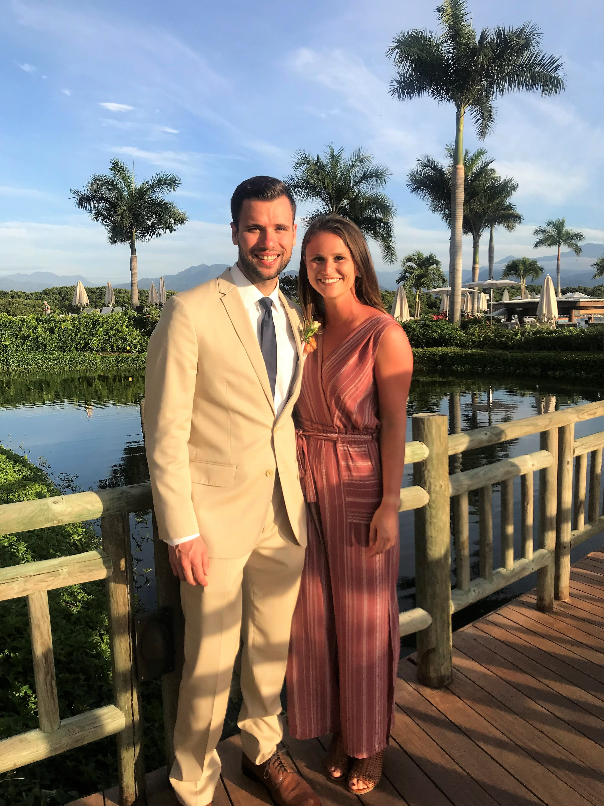

<link rel="stylesheet" href="styles.css" type="text/css">

<h5> Project Manager | Continuous Improvement Leader | Production & Process Engineering Professional </h5>

---

Hello! I'm Ryan.

I am a Project Management, Process Improvement, and Production Engineering professional currently serving in a key project management role for [EQT Corporation](https://www.eqt.com/). Haven't heard of EQT? EQT is the top producer of natural gas in the United States, and is a technology-driven and innovative leader in the industry. EQT currently produces approximately 50% more natural gas than #2 ExxonMobil and nearly 100% more than #7 BP (as of 2019-Q1).

I have progressed through various leadership roles with EQT over the past 5 years, and have had the opportunity to successfully lead and direct a number of key projects and programs for the orgainizaton; all while working with some amazing people in the process. Through my experience, I have become highly-passionate about business optimiziation, continuous improvement, and leveraging data analytics to improve operational efficiencies. In my two most recent roles with EQT, my teams have been able to deliver over $10 million in annual cost savings through operational process improvements. 

I earned by Bachelor's degree in Chemical Engineering from the University of Pittsburgh, will be obtaining my PMP in April 2019, and am looking forward to obtaining my MBA in the near future.

You can view my full resume [here](resume.html).

Outside of work, I love to travel and explore new places. I also enjoy all-things outdoors including hiking, biking, snowboarding, and playing sports. I love to challenge myself, develop my current skills, and actively learn new skills.  You can learn about some of my trips and check out photos [here](travel.html). The picture to the right shows my girlfriend, Stephanie, and I during our 2019 visit to Puerto Vallarta, Mexico. 

Stephanie has recently started an amazing new role in San Diego, CA and I am working to balance time between Pittsburgh and San Diego, which has proven to be quite difficult, probably due to the 2,500 miles of separation! I'm hoping that we can be back together full-time here soon.

---

This site was built entirely by me, and was done as a personal learning experience on how to build and host a website utilizing Rstudio and Github.